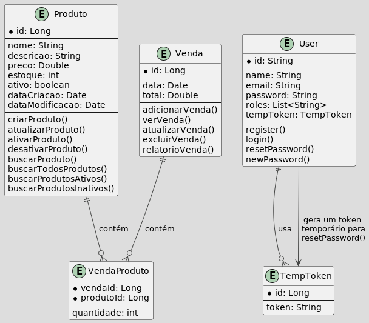

# E-commerce API

Este é um projeto de uma API para um sistema de e-commerce, desenvolvida com Java 17 e Spring Boot 3.3.1. 

O sistema utiliza um banco de dados relacional em memória **H2** e segue a arquitetura **Layered Architecture**. 

Para a sua segurança, foi implementado um sistema de autenticação e autorização com **JWT**.

## Funcionalidades

- **Produto**
    - Permitir que os usuários criem, leiam, atualizem e excluam produtos.
    - Criar validações para os dados de entrada na criação de um produto (ex.: preço deve ser positivo).
    - Um produto não pode ser deletado após ser incluído em uma venda, mas pode ser inativado.
    - Controlar o estoque do produto para evitar vendas com estoque insuficiente.

- **Vendas**
    - Permitir que os usuários criem, leiam, atualizem e excluam vendas.
    - Criar método para filtrar vendas por data. **(__Não consegui implementar ❌__)**
    - Criar métodos de relatório de vendas (mensal e semanal). **(__Não consegui implementar ❌__)**

- **Cache**
    - As leituras na API salvam as informações no cache para melhorar a performance.

- **Tratamento de Exceções**
    - Algumas exceções específicas são tratadas e retornam a mesma resposta.

## Estrutura do Projeto

O projeto segue a arquitetura Layered Architecture, organizado nas seguintes camadas:
- **Controllers:** Controladores REST para lidar com as requisições HTTP.
- **Services:** Camada de serviços onde a lógica de negócio é implementada.
- **Repositories:** Interfaces JPA para interagir com o banco de dados.
- **Entities:** Classes que representam as tabelas do banco de dados.
- **DTOs:** Classes que representam os objetos de transferência de dados.
- **Config** Classes de configuração do projeto.
- **Exceptions** Classes de exceções personalizadas.
- **Security** Classes de configuração de segurança.

## Como configurar o envio do email automático
Para configurar o email e a senha, você deve ir ao arquivo **application.properties** e substituir os valores das propriedades **spring.mail.username** e **spring.mail.password** pelos valores do seu email e senha, respectivamente.
- Por motivos de segurança, é **__recomendado__** que você crie um email específico para o envio de emails automáticos.
Para esse projeto, optei por inserir as meu email e uma **__senha gerada para aplicativos do Google, mas isso não é recomendado.__**
- Depois da data de entrega, eu irei remover essas minhas informações do arquivo **application.properties**.
- Tive dificuldades de configurar as **variáveis de ambiente** no meu sistema linux, mas caso você consiga adicioná-las, é **recomendado** que você faça isso.

## Modelo ER
O modelo entidade relacionamento foi criado usando a ferramenta **PlantUML**.

Para poder visualizar corretamente o diagrama, é necessário instalar a extensão PlantUML na sua IDE de preferência e também instalar o **Graphviz**.
Para instalar o Graphviz no seu SO, siga as instruções no site oficial: [Graphviz](https://graphviz.org/download/)

Aqui está o diagrama Entidade-Relacionamento (ER) do sistema:

